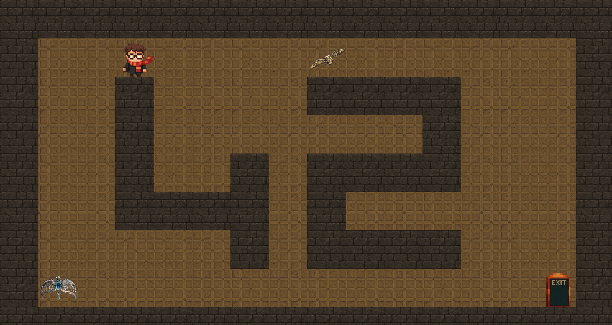

# so_long 🪄✨



## Description

A 2D top-down game developed as part of the 42 school curriculum. The player controls Harry Potter through dungeon-like maps with the objective of collecting all Horcruxes before reaching the exit.

This project implements core game development concepts including sprite rendering, player movement, collision detection, and map validation. Built entirely in C using the MiniLibX graphics library, it demonstrates proficiency in memory management, event handling, and algorithmic problem-solving.

## Magical Features ⚡

- **Crystal-clear graphics**: 120x120 pixel sprites (way better than those moving staircases)
- **Four-directional movement**: Up, down, left, right - basically Apparition but with arrow keys
- **Horcrux hunting**: Collect them all! (No basilisk fangs required)
- **Enchanted exits**: The door magically opens once you've grabbed all the Horcruxes
- **Move counter**: Because the Ministry of Magic likes to track everything you do
- **Foolproof map validation**: Checks walls, paths, and won't let you create a Room of Requirement
- **Custom maps**: Design your own dungeons with `.ber` files (Moody would be proud)

## Requirements

- Linux operating system
- X11 development libraries
- Make
- GCC compiler

## Installation

```bash
make
```

This will compile the project and generate the `so_long` executable.

## Usage

```bash
./so_long <map_file.ber>
```

**Example:**
```bash
./so_long maps/valid_maps/map_normal.ber
```

## Controls

- **Arrow Keys**: Move the player
- **ESC**: Exit the game
- **X Button**: Close the window

## Map Format

Maps are defined in `.ber` files using the following characters:

- `1`: Wall
- `0`: Floor (empty space)
- `P`: Player starting position
- `C`: Collectible (Horcrux)
- `E`: Exit

### Map Validation Rules

- Map must be rectangular
- Map must be completely surrounded by walls (`1`)
- Must contain exactly one player (`P`)
- Must contain exactly one exit (`E`)
- Must contain at least one collectible (`C`)
- Must have a valid path from player to all collectibles and the exit

### Example Map

```
111111
1P0C01
100001
1C00E1
111111
```

## Project Structure

```
.
├── srcs/              # Main source files (game logic)
├── includes/          # Header files
├── mlx/              # MiniLibX graphics library
├── ft_printf/        # Custom printf implementation
├── get_next_line/    # File reading utility
├── sprites/          # Game sprites (.xpm files)
└── maps/             # Map files
    ├── valid_maps/   # Valid test maps
    └── invalid_maps/ # Invalid test maps (for error handling)
```

## Make Commands

- `make`: Build the project
- `make clean`: Remove object files
- `make fclean`: Remove object files and executable
- `make re`: Rebuild the project from scratch

## Author

akoaik - [42 School](https://42.fr/)

---

*Note: This project features a Harry Potter theme with custom sprites and Horcrux collectibles. All Harry Potter references are used for educational and entertainment purposes.*
